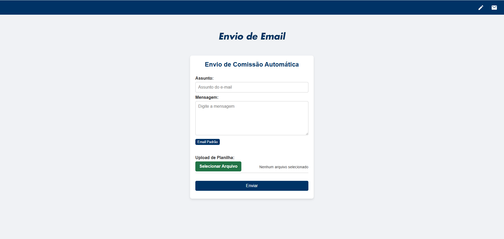
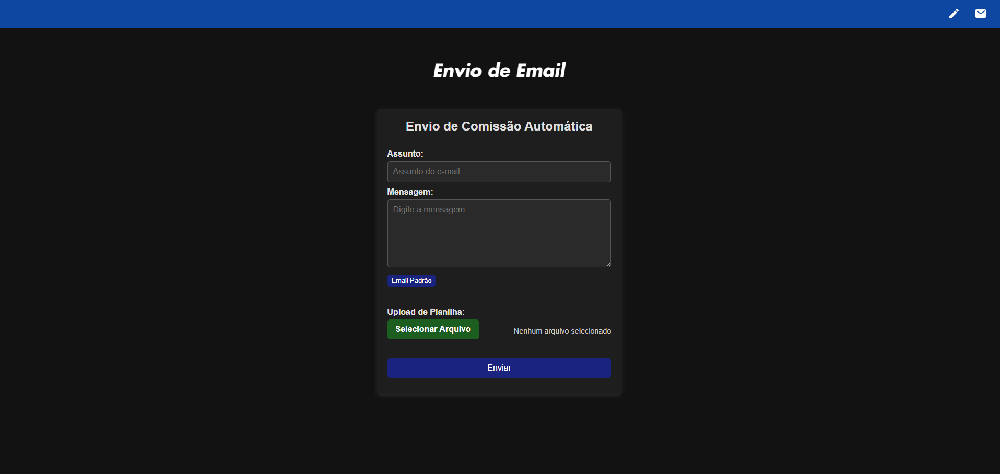

# Envio de Comissão

Este projeto é um sistema de upload e envio de comissão por e-mail para os representantes, desenvolvido com **Node.js**. Ele processa uma planilha `.xlsx` contendo dados de comissões, segmenta por código de representante, gera relatórios personalizados e envia automaticamente os arquivos por e-mail.

## ✨ Funcionalidades

- Upload de planilha `.xlsx` com dados de comissão (aba `apibase` obrigatória).
- Processamento e separação dos dados por código de representante (`COD`).
- Geração automática de planilhas personalizadas para cada representante.
- Envio de e-mails com os relatórios em anexo.
- Organização automática dos arquivos enviados e gerados por ano e mês.
- **Busca automática dos e-mails (principal, alternativo, regional e controladoria) por código através da planilha `comin_data.xlsx`.**
- Log de alertas para códigos encontrados na planilha que não estão cadastrados.
- **Envio de e-mails para múltiplos destinatários por representante:** o sistema envia cópias da comissão para os e-mails principais, alternativos, regionais e controladoria vinculados ao código.
- **Configuração de mensagem e assunto via interface web**, permitindo que o texto padrão de e-mail seja editável antes do envio.
- **Controle de envio com delay de 1000ms** entre os e-mails para evitar bloqueios por spam.
- **Formatação avançada das planilhas geradas**, incluindo alinhamentos, bordas, cores e formatação de valores monetários para melhor visualização.

## 🛠 Tecnologias Utilizadas

- [Node.js](https://nodejs.org/)
- [Express.js](https://expressjs.com/)
- [Multer](https://github.com/expressjs/multer) — upload de arquivos
- [Nodemailer](https://nodemailer.com/) — envio de e-mails
- [xlsx](https://www.npmjs.com/package/xlsx) — leitura de planilhas Excel
- [xlsx-populate](https://www.npmjs.com/package/xlsx-populate) — criação e formatação de planilhas Excel
- [HTML + CSS + JS] — interface web simples (estática)

## 📁 Estrutura do Projeto

```
enviodeemail/
│── node_modules/         # Dependências do projeto
│── public/               # Interface web (frontend)
│   ├── image/            # Imagens do projeto: ícone e logos
│   ├── styles/
│   │   └── send.css      # Estilo da página de upload
│   └── send.html         # Página de upload e envio
│── relatorios/           # Relatórios gerados por vendedor (organizados por ano/mês)
│── uploads/              # Planilhas originais enviadas (organizadas por ano/mês)
│── .env                  # Variáveis de ambiente (credenciais de e-mail)
│── mail.js               # Script principal do servidor
│── comin_data.xlsx       # Planilha com lista de códigos e e-mails
│── package.json          # Metadados e dependências do projeto
│── message.json          # Arquivo com mensagem padrão editável para envio de e-mails
│── README.md             # Este arquivo
```

## 📧 Variáveis Disponíveis na Mensagem Padrão do E-mail

No texto da mensagem padrão que você edita na interface web (e que fica salvo em `message.json`), você pode usar as seguintes variáveis especiais que serão automaticamente substituídas pelo sistema no momento do envio:

- `<ano>`: será substituído pelo ano atual com quatro dígitos (exemplo: `2025`).

- `<mes>`: será substituído pelo nome completo do mês atual (exemplo: se o mês atual for junho, será retornado `junho`).

- `<pmes>`: será substituído pelo nome completo do mês anterior ao atual (exemplo: se o mês atual for junho, será retornado `maio`).

Essa padronização facilita a organização cronológica dos e-mails gerados e enviados pelo sistema.

## ⚙️ Instalação e Configuração

1. **Clone o repositório:**

   ```bash
   git clone https://github.com/jEduuardo/EnvioEmail.git
   ```

2. **Instale as dependências:**

   ```bash
   cd enviodeemail
   npm install
   ```

3. **Crie um arquivo `.env` na raiz do projeto:**

   ```env
   EMAIL_USER=seuemail@gmail.com
   EMAIL_PASS=suasenhaouAppPassword
   ```

   > 💡 Use uma [senha de app do Gmail](https://support.google.com/accounts/answer/185833?hl=pt-BR) se estiver com autenticação em dois fatores ativada.

4. **Adicione a planilha `comin_data.xlsx` na raiz do projeto**

   A aba deve se chamar **`consulta_comin`** e conter as colunas:
   - `COD`
   - `PRINCIPAL`
   - `ALTERNATIVO`
   - `REGIONAL`
   - `CONTROLADORIA`

5. **(Novo) Edite a mensagem padrão de e-mail via interface web**, que será salva em `message.json` na raiz do projeto.

6. **Inicie o servidor:**

   ```bash
   node mail.js
   ```

7. **Acesse a interface web no navegador:**

   ```
   http://localhost:3000/public/send.html
   ```

## ✅ Como Usar

1. Acesse a página de envio.
2. Preencha os campos **Assunto** e **Mensagem** (a mensagem padrão pode ser carregada e editada).
3. Anexe a planilha de comissão (deve conter uma aba chamada `apibase` com a coluna `COD`).
4. Clique em **Enviar** e aguarde o processamento.
5. Os e-mails serão enviados automaticamente para todos os endereços associados ao código (`PRINCIPAL`, `ALTERNATIVO`, `REGIONAL`, `CONTROLADORIA`).
6. Os arquivos serão organizados nas pastas `relatorios/` e `uploads/`.

## ⚠️ Observações Importantes

- A aba da planilha de comissão deve se chamar exatamente `apibase`.
- A planilha `comin_data.xlsx` deve conter os e-mails vinculados a cada código.
- Códigos presentes na planilha `apibase` mas **não encontrados na planilha `comin_data.xlsx`** serão apenas logados no console.
- O envio de e-mails aguarda 1000ms entre cada mensagem para evitar bloqueios por spam.
- A formatação da planilha gerada segue padrão de cores, bordas, alinhamento e formatação monetária para melhor leitura.
- A mensagem de e-mail padrão é editável via interface e salva em arquivo JSON para reutilização.
- O sistema envia e-mails para múltiplos destinatários por representante, conforme cadastrado na planilha de e-mails.

---

## 👨‍💻 Desenvolvido por Eduardo Junqueira

📧 [eduardojunqueira2005@gmail.com](mailto:eduardojunqueira2005@gmail.com)
🧩 [LinkedIn](https://www.linkedin.com/in/eduardo-junqueira-0473652b1/)

## Temas

### Modo Claro


### Modo Escuro

